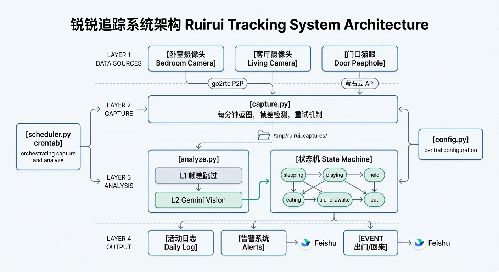
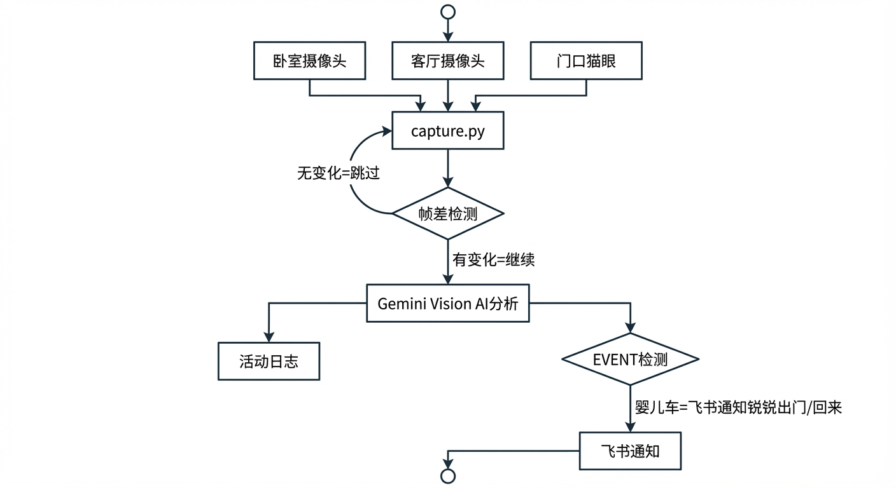

# 锐锐追踪系统 (Ruirui Tracker)

基于多摄像头 + Gemini Vision 的婴儿活动追踪系统。实时监控8个月婴儿"锐锐"的状态，自动检测出门/回家事件，通过飞书推送通知。

## 架构



### 数据流



```
摄像头 (go2rtc/萤石云)
  → capture.py (每分钟截图 + 帧差检测)
  → analyze.py (L1跳过/L2 Gemini分析 → 状态机 → 告警/EVENT)
  → 飞书通知
```

## 文件结构

```
ruirui_tracker/
├── scheduler.py    # 统一调度入口 (crontab 每分钟调用)
├── capture.py      # 采集层：多源抓帧 + 重试 + 帧差检测
├── analyze.py      # 分析层：Gemini → 状态机 → 告警 → EVENT
├── config.py       # 集中配置 (路径/参数/阈值，支持环境变量覆盖)
├── state.py        # 状态机：管理锐锐状态和转换
├── alert.py        # 告警层：分级通知 (全部走飞书)
├── report.py       # 报告生成：每小时/每天汇报
├── pyproject.toml  # Python 依赖 (uv 管理)
└── docs/
    ├── architecture.png  # 架构图
    └── flow.png          # 流程图
```

## 数据源

| 摄像头 | 型号 | 取流方式 | 用途 |
|--------|------|----------|------|
| 卧室 | 米家C302 | go2rtc P2P | 睡觉/活动监控 |
| 客厅 | 米家C302 | go2rtc P2P | 活动/陪伴监控 |
| 门口猫眼 | 海康DP2C | 萤石云API | 出门/回家检测 |

## 两级分析策略

- **L1 帧差检测**：对比最新帧与最早帧，差异 < 阈值(8.0) 则跳过 Gemini（省钱）
- **L2 Gemini 分析**：画面有变化或超过30分钟强制分析一次
- 采样：卧室5张 + 客厅5张 + 猫眼2张 = 最多12张/次

## 状态机

```
sleeping ←→ playing ←→ held
    ↕           ↕         ↕
  eating    alone_awake  out
```

状态转换触发告警：
- `alone_awake` 超过5分钟 → 🚨 紧急通知
- `sleeping` 超过3小时 → 💤 提醒
- 猫眼检测到婴儿车 → 🚼 出门/回来通知

## 配置

所有配置在 `config.py`，关键参数支持环境变量覆盖：

| 环境变量 | 默认值 | 说明 |
|----------|--------|------|
| `RUIRUI_CAPTURE_DIR` | `/tmp/ruirui_captures` | 截图存储目录 |
| `RUIRUI_LOG_DIR` | `~/.openclaw/workspace/memory` | 日志目录 |
| `GO2RTC_URL` | `http://192.168.2.24:2984` | go2rtc 地址 |
| `HA_URL` | `http://192.168.2.24:8123` | Home Assistant 地址 |
| `OPENCLAW_HOOK_URL` | `http://127.0.0.1:18789/hooks` | 通知 webhook |
| `OPENCLAW_HOOK_TOKEN` | (空) | webhook 认证 token |
| `GEMINI_KEY_PATH` | `~/.gemini_key` | Gemini API key 文件 |

## 安装

```bash
# 依赖
uv sync

# 凭证文件
echo "your-gemini-key" > ~/.gemini_key
echo "your-ha-token" > ~/.ha_token
echo "your-ys7-appkey" > ~/.ys7_appkey
echo "your-ys7-secret" > ~/.ys7_secret
```

## 运行

```bash
# 手动执行一次采集+分析
uv run python scheduler.py

# 或单独执行
uv run python capture.py     # 只截图
uv run python analyze.py     # 只分析

# 生成报告
uv run python report.py hourly  # 每小时汇报
uv run python report.py daily   # 全天报告

# crontab (每分钟)
* * * * * cd /path/to/ruirui_tracker && .venv/bin/python scheduler.py >> /tmp/ruirui_scheduler.log 2>&1
```

## 成本

- Gemini 2.5 Pro：~$0.003/次（12张图）
- 每天约 20-40 次调用（大量被帧差跳过）
- 预估日成本：$0.06-0.12

## 通知策略

- ✅ 所有通知走飞书（不再用小爱播报）
- ✅ 出门/回家事件：30分钟内不重复通知
- ✅ 独自清醒告警：5分钟阈值
- ✅ 连续未知状态：自动告警
